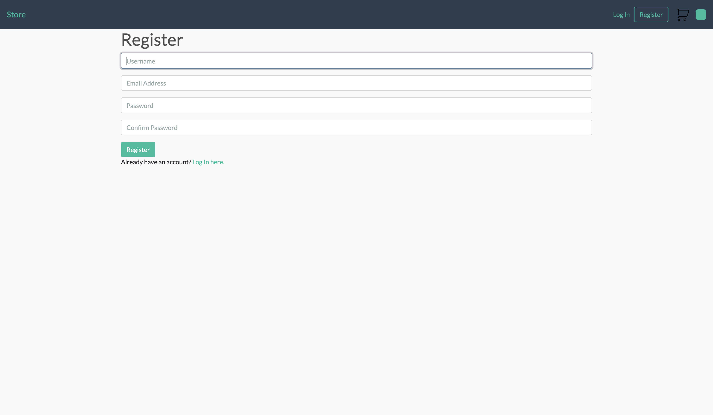
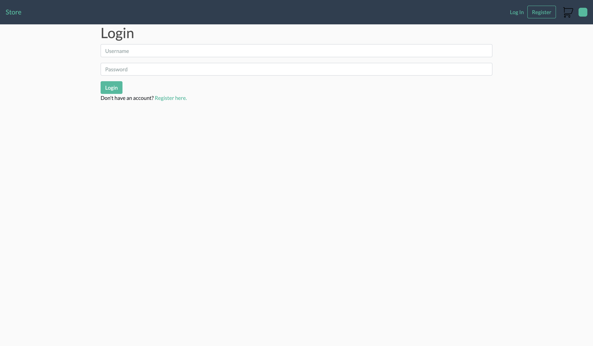
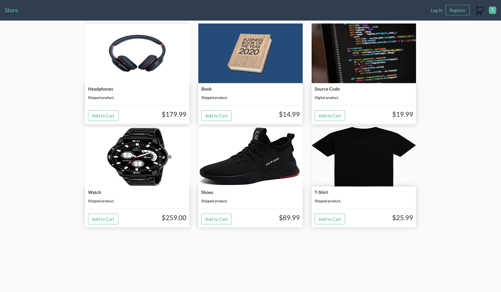
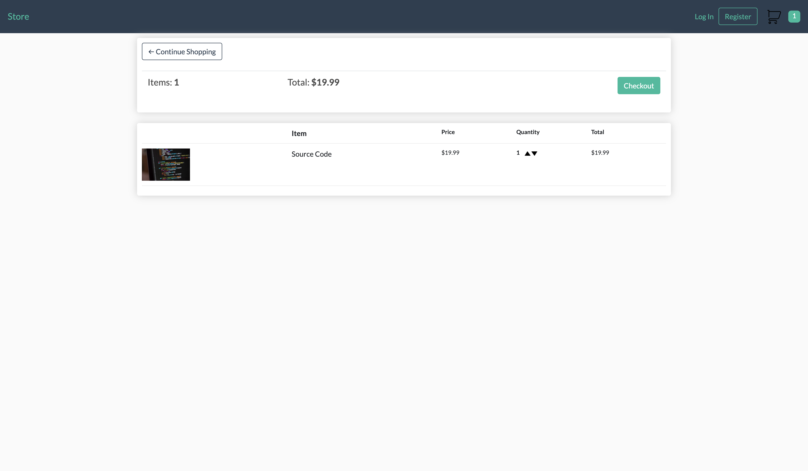
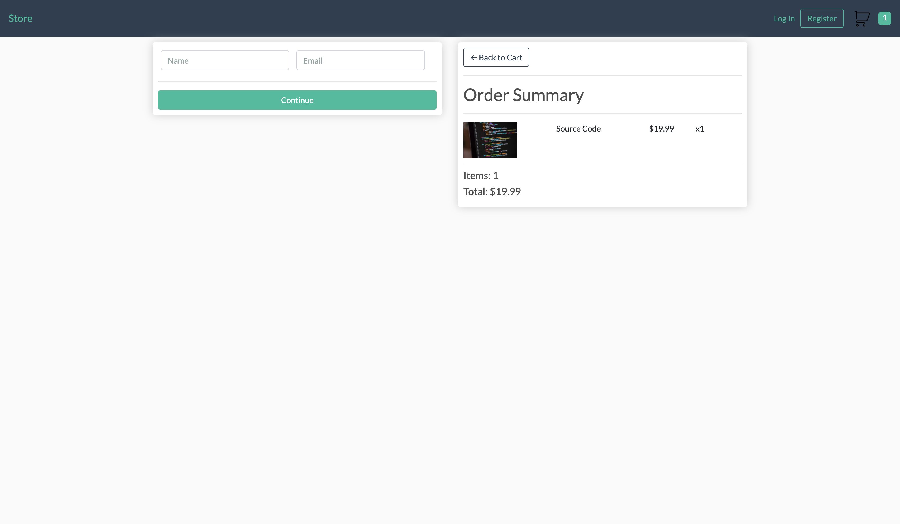
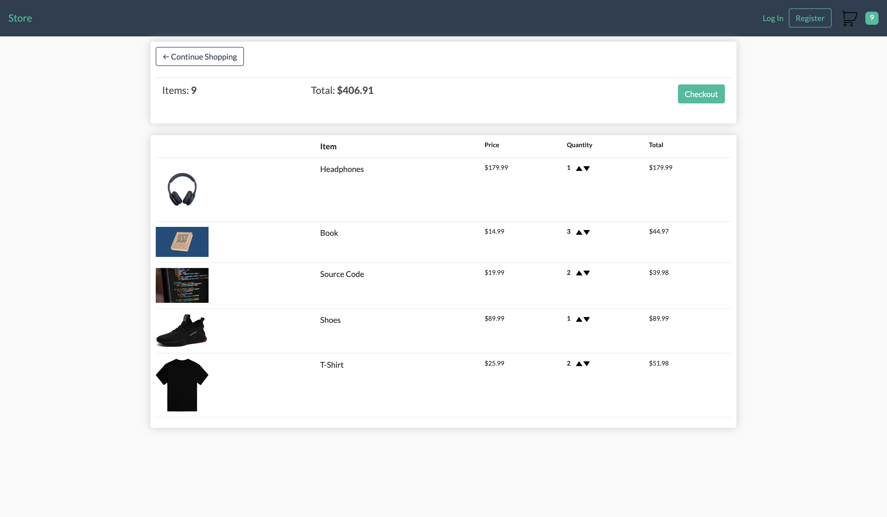
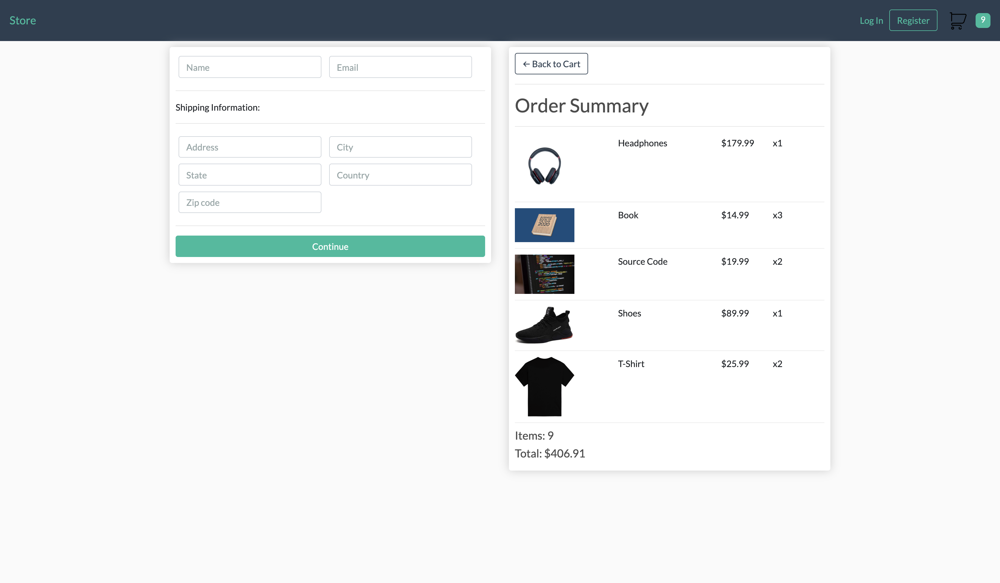

# Store

Store is an e-commerce web application built using Django on the backend and HTML5, CSS3, and JavaScript on the frontend. Store is contained in a project called E-Commerce.

Store enables the users to do the following:

1. Select from a variety of items and add them to the cart.
2. See their cart details, including the name and picture of the items that are added and their corresponding amount and price, the total amount of items and the total price.
3. Within the cart view, the user can dynamically increase or decrease the amount of items that are added to the cart.
4. Within the checkout view the user can view the order summary. In addition, the user is required to enter his/her shipping address, unless the user is only ordering digital products. Also, the user is also required to enter his/her name and email address if not authenticated.
5. The application lets the user to sign up and log in. However, the user can still order from the store without being authenticated. If that is the case, order items are stored in cookies.
6. The application does not allow the user to make payments.

### Dependencies

The dependencies can be found in the [requirements.txt](requirements.txt) file.

### Screenshots









### Setup

```shell script
git clone https://github.com/ardaatahan/django-ecommerce
cd ecommerce
pip install -r requirements.txt
```

When the dependencies are installed, you can run this command to run your server.

```shell script
python manage.py runserver
```

Run the following commands to migrate the database.

```shell script
python manage.py makemigrations
python manage.py migrate
```

Or you can run this command to acceess the shell window.

```shell script
python manage.py shell
```

### Note

I was inspired by Dennis Ivy for this project.
